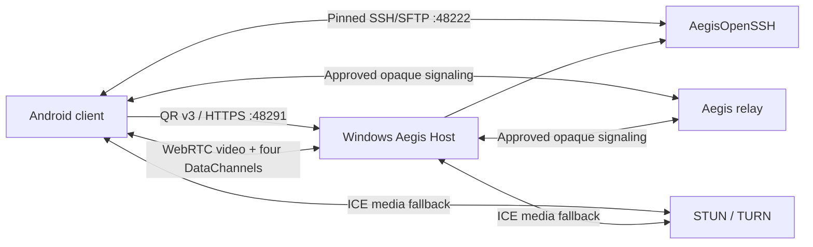

# Architecture

Aegis is an Android client, a visible Windows 10/11 x64 host, and optional
Internet rendezvous infrastructure.

## Trust boundaries

- Device identity: algorithm-tagged P-256/SHA-256 public identity.
- Enrollment: signed, expiring, one-use QR payload v3 plus visible Windows
  approval.
- Local session: pinned peer, authenticated endpoint, WebRTC DTLS/SRTP, and
  per-device permissions.
- Remote session: relay authorization plus application E2EE. Approval or TLS
  alone does not enable remote input/clipboard.
- Terminal/files: separate SSH transport with host-key pinning and an
  Android-generated authentication key.
- Installation: Inno Setup may mutate only Aegis-owned resources.

Android Keystore and Windows DPAPI provide different storage guarantees.
Android reports the measured provider level. Windows currently reports its
DPAPI-wrapped software identity as wrapped software.

## Android composition

`app-android` owns UI and platform adapters:

- QR scanning/verification and PC profile creation;
- Android identity and secure credential references;
- native WebRTC viewer and four DataChannels;
- input and clipboard bridges;
- SSHJ terminal/SFTP clients;
- route diagnostics, relay, STUN/TURN, and Wake-on-LAN;
- SQLDelight profile persistence.

Platform-neutral decisions live under `shared`: models, route selection,
pairing state, permissions, quality policy, clipboard policy, session
lifecycle, host-key validation, and SSH/SFTP ports.

## Windows composition

- `desktop-agent`: identity, trust, QR v3, local endpoints, relay lifecycle,
  approvals, revocation, and AegisOpenSSH integration.
- `desktop-webrtc`: native peer connection, Desktop Duplication capture,
  protocol signaling, stats, four DataChannels, and cleanup.
- `desktop-input`: SendInput mapping, rate limits, and pressed-state cleanup.
- `desktop-clipboard`: bounded policy-driven text synchronization.
- `desktop-main`: visible window/tray and product application entry point.
- `packaging/windows`: Inno Setup and isolated OpenSSH ownership scripts.

The native capture source is the product path. The monitor provider publishes
the exact native `DesktopSource` IDs consumed by `VideoDesktopSource`, and it
associates AWT geometry only when source/display counts match and every native
ID is unique. A mismatch fails closed with `CAP-5005`/`CAP-5006`; an explicit
unknown selection fails with `CAP-5003` and is never redirected to another
display. Physical switching and pointer geometry across real multi-monitor
layouts remain an RC evidence gate.

## Protocol and channels

`protocol:protocol-models` defines versioned messages, signaling adapters,
strict DataChannel routing, and the encrypted protocol channel.

| Channel | Reliability | Purpose |
| --- | --- | --- |
| `aegis-control` | Reliable, ordered | Lifecycle, monitors, quality, stats, control |
| `aegis-pointer` | Unordered, no retransmission | Pointer movement |
| `aegis-keyboard` | Reliable, ordered | Keyboard/button transitions and text |
| `aegis-clipboard` | Reliable, ordered, bounded | Authorized clipboard text |

The application E2EE layer uses ephemeral P-256 ECDH, HKDF-SHA-256,
AES-256-GCM, authenticated sequence/generation fields, and acknowledged rekey.
Its crypto/adapter implementation exists, but the full integrated coverage and
physical automatic-rekey matrix remain open. Native transport encryption must
not be used to claim that gate.

## Connectivity services

The Ktor relay performs challenge/proof device registration, target
rendezvous, visible approval, event delivery, opaque signaling forwarding,
temporary TURN credentials, health/readiness/metrics, rate limits, and durable
PostgreSQL/Redis mode. Development in-memory/JSON mode must be enabled
explicitly.

The relay is not an SSH proxy or custom video relay. WebRTC selects direct ICE
or TURN. SSH/SFTP requires a separate reachable TCP route to port 48222.

## Persistence

- Android PC profiles: SQLDelight; secrets stored by reference.
- Android identity/credentials: Android Keystore at the actually reported
  security level.
- Windows identity/trust/settings: DPAPI-protected or user-restricted storage.
- Windows SSH state: Aegis-owned files under
  `%ProgramData%\Aegis\OpenSSH`.
- Relay: PostgreSQL/Redis for durable deployment; explicit development mode for
  ephemeral/JSON operation.

Schema and protocol changes require migrations or a deliberate fail-closed
repair/re-pair path. A fallback must never silently weaken identity,
authorization, E2EE, or pinning.
